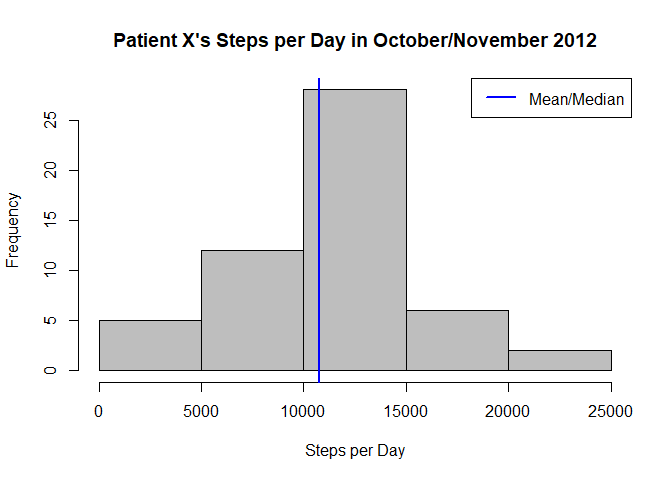
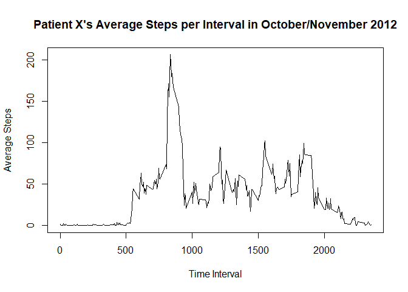
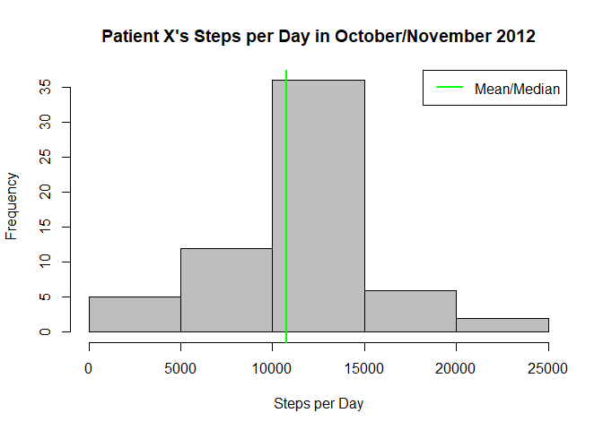
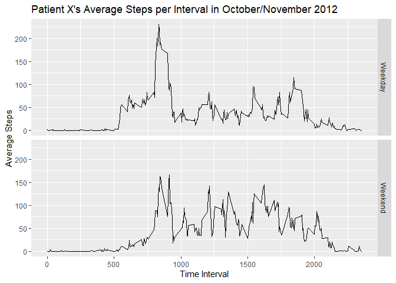

## Loading and preprocessing the data


```r
rawdata <- read.csv("activity.csv")
```
## What is mean total number of steps taken per day?
  

```r
#turn off scientific notation
options(scipen = 999)

#determine total number of steps per day
stepsperday <- aggregate(rawdata$steps,by=list(days = rawdata$date),sum)

#develop histogram to display data
hist(stepsperday$x, col = "gray", main = "Patient X's Steps per Day in October/November 2012", xlab = "Steps per Day")

#determine mean and median of data set
meansteps <- mean(stepsperday$x, na.rm = TRUE)
mediansteps <- median(stepsperday$x, na.rm = TRUE)

#add vertical lines to denote mean and median of data set
abline(v = meansteps, col = "red", lwd = 2)
abline(v = mediansteps, col = "blue", lwd = 2)
legend(x = "topright","Mean/Median",col = "blue",lwd = 2)
```

<!-- -->
<br>


**The mean total number of steps per day is 10766.19.  The median total number of steps per day is 10765.**


## What is the average daily activity pattern?


```r
#determine average number of steps per interval 
stepsperinterval <- aggregate(rawdata$steps,by=list(interval = rawdata$interval),mean, na.rm = TRUE)

#determine interval with maximum number of steps 
maxinterval <- stepsperinterval[which.max(stepsperinterval$x),]

#plot the average number of steps over intervals
plot(stepsperinterval$interval,stepsperinterval$x, type = "l", col = "black", main = "Patient X's Average Steps per Interval in October/November 2012", xlab = "Time Interval",ylab = "Average Steps")
```

<!-- -->
  <br>
  
  
  
**On average across all the days in the dataset the 835 interval contains the maximum number of steps.** 


## Imputing missing values

```r
#determine number of NA values
totalna <- length(is.na(rawdata$steps))
```
**There are 17568 NA values in the raw dataset.**


```r
#populate records with NA based upon the average for that specific time interval
newdata <- rawdata %>% group_by(interval) %>% mutate(steps = ifelse(is.na(steps),mean(steps, na.rm = TRUE),steps))
```


```r
#determine total number of steps per day
stepsperday2 <- aggregate(newdata$steps,by=list(days = newdata$date),sum)

#develop histogram to display data
hist(stepsperday2$x, col = "gray", main = "Patient X's Steps per Day in October/November 2012", xlab = "Steps per Day")

#determine mean and median of data set
meansteps2 <- mean(stepsperday2$x)
mediansteps2 <- median(stepsperday2$x)

#add vertical lines to denote mean and median of data set
abline(v = meansteps2, col = "red", lwd = 2)
abline(v = mediansteps2, col = "green", lwd = 2)
legend(x = "topright","Mean/Median",col = "green",lwd =2)
```

<!-- -->
<br>


**The mean total number of steps per day is 10766.19.  The median total number of steps per day is 10766.19.**

<br>
**Clearly these values differ from those obtained with the dataset with null values. The mean was not impacted by imputing missing data on the estimates of the total daily number of steps. The median increased by 1.19.** 


## Are there differences in activity patterns between weekdays and weekends?

```r
#transform date into a day of the week
newdata$weekday <-weekdays(as.Date(newdata$date))

#develop function to transform day of the week into weekend or weekday
daytype <- function(weekday){
  if(weekday %in% c('Monday','Tuesday','Wednesday','Thursday','Friday'))
    return("Weekday")
  else if (weekday %in% c('Saturday','Sunday'))
    return("Weekend")
}
#apply that function accross the dataset
newdata$daytype <- sapply(newdata$weekday, FUN = daytype)

#determine average number of steps per interval per daytype 
stepsperinterval2 <- aggregate(newdata$steps,by=list(interval = newdata$interval,daytype = newdata$daytype),mean)

#plot the data 
ggplot(data = stepsperinterval2, aes(x = interval, y = x)) + geom_line() + facet_grid(daytype~.) + ggtitle("Patient X's Average Steps per Interval in October/November 2012") + xlab("Time Interval") + ylab("Average Steps")
```

<!-- -->


